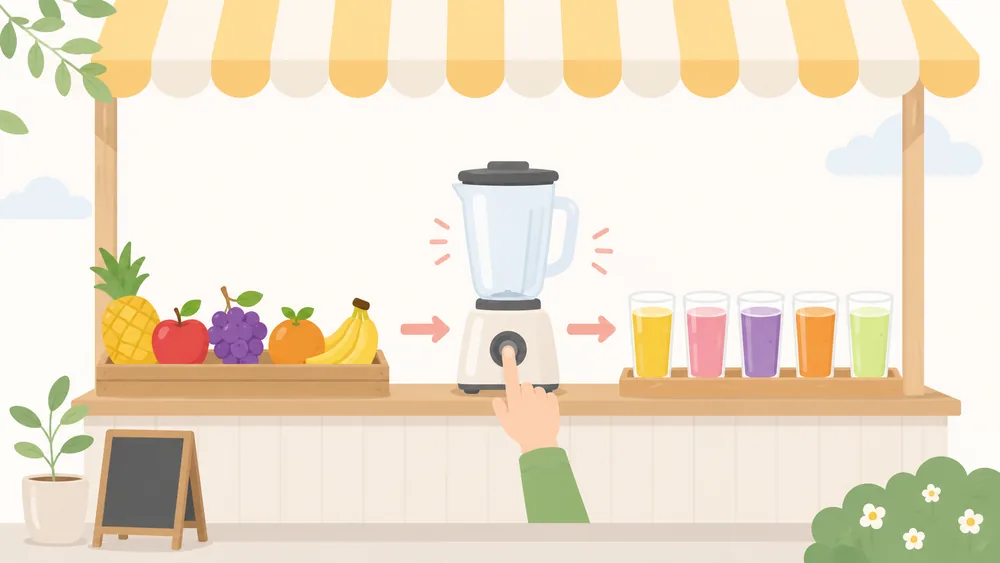

<!--
  本文執筆済み（2026-08-05）。
    設計図      : 00_research/02_content/per-session/session-02.md
    決定        : 00_research/06_decisions/decisions.md 2026-07-31（決定5・6／運用細則／揃える3点）
    図解部品    : site/docs/figures.md（6章に第2回の図と部品の対応表、9章に compare の警告）

    front matter は order: だけ。タイトル「オーバーロード・コンストラクタ」・呼び名「生成の書」・
    permalink は src/_data/site.json から自動で入る。

    この回の作りの要点:
    ・説明の順序は「オーバーロード → コンストラクタ → コンストラクタのオーバーロード」。
      スライドの並び順（コンストラクタ先行）ではなく、演習docx・ゴール・まとめの3点に揃えた。
    ・全7回で唯一の「画像を貼る」図（図C ジュース屋）。文字が焼き込まれていない画像なので
      ラベルは重ねず、画像の下にテキストのラベル一覧を置いた（figures.md 7章の推奨）。
      幅375pxでは果物の見分けが付かないため、ラベル側に果物名を文字で書き、
      画像は原寸 webp へのリンクにして拡大できるようにしてある。
    ・図A（キャラ作成画面）は compare{axis:"v"}＋box の入れ子。専用CSSは足していない。
    ・図B（オブジェクト製造機）は compare{axis:"v", cols:3}＋cards で代替した。
      「変換」の図なので axis:"h" にはしない（決定 運用細則）。専用部品にはしていない。
    ・スライド7の全角スマートクォートは半角に直して載せ、全角版は ```java error で
      「つまずきの実演」として別に見せている（error ブロックは全角チェックの対象外）。
-->

<h2 class="part">第1部 直感的につかむ</h2>

### この回でできるようになること

- 同じ名前のメソッドを、**引数の数や型が違えば**いくつも作れることが分かる。
- `new` した瞬間に呼ばれる<span class="term">コンストラクタ</span>を書いて、作りたてのオブジェクトに最初の値を入れられる。
- コンストラクタを複数用意して、**オブジェクトの作り方を選べる**クラスにできる。

### 勇者一行で例えると

[第1回](01-class.html)では「設計図から実体を作る」形を見ました。
第4回からは勇者一行が共通の題材になりますが、冒険には**戦う相手**が必要です。
この回で作るのはそちら側 ―― **モンスター**です。



相手は1体では終わりません。HP 10 の雑魚から HP 300 のドラゴンまで、
**同じ設計図から中身の違う実体を何体も作る**ことになります。
そのとき必要になるのが「作るときに値を渡すしくみ」と「作り方を何通りか用意するしくみ」です。

<div class="note note--hint">
<span class="note__title">たとえは2本あります</span>

**オーバーロード**は**ジュース屋さん**、**コンストラクタ**は**ゲームのキャラクター作成画面**で
説明します。どちらも身近なたとえで、モンスターの話は演習（第2部）で出てきます。

</div>

### 図解でつかむ

#### 1. オーバーロード ── 同じ名前で、渡すものが違う

<span class="term">オーバーロード</span>は、**同じ名前のメソッドを、引数の数や型を変えていくつも作る**ことです。

ジュース屋さんで考えます。お客が言うのは「作って！」の一言だけ。
でも**渡す材料が違えば、出てくるものが変わります。**



<a href="../assets/img/figures/s02-juice-stand.webp">

</a>

絵の中のものは、コードではこう対応します。**画像を開くと大きく表示できます。**

- **果物**（パイナップル・りんご・ぶどう・みかん・バナナ） ── メソッドに渡す**引数**
- **ミキサーのボタン** ── メソッドの**名前**。押すボタンはいつも `makeJuice` の1つだけ
- **できたジュース**（5杯とも色が違う） ── 実行された**結果**。渡した材料で変わる

渡すものと出てくるものの対応は、たとえばこの3通りです。

- `makeJuice("りんご")` → りんごジュース
- `makeJuice("みかん")` → みかんジュース
- `makeJuice("りんご", "みかん")` → ミックスジュース



Java で書くと、**メソッド名は同じまま、引数だけを変えて並べる**ことになります。
強調した2行が、名前は同じで引数が違うところです。

```java hl=1,5
public void makeJuice(String fruit) {
    System.out.println(fruit + "ジュース");
}

public void makeJuice(String fruit1, String fruit2) {
    System.out.println(fruit1 + "と" + fruit2 + "のミックス");
}
```

呼ぶ側は、**どちらを呼ぶかを指定しません。** 渡したものに合うほうが自動で選ばれます。



```java nonum
shop.makeJuice("りんご");
shop.makeJuice("りんご", "みかん");
```


```text
りんごジュース
りんごとみかんのミックス
```



<div class="table-scroll">

| 渡したもの | 選ばれるメソッド |
|---|---|
| 文字列を1個 | `makeJuice(String fruit)` |
| 文字列を2個 | `makeJuice(String fruit1, String fruit2)` |
| 文字列と数値 | `makeJuice(String fruit, int count)` |

</div>

Java が見るのは **引数の数・型・順番** の3つです。

<div class="note note--warn">
<span class="note__title">戻り値では選ばれません</span>

引数がまったく同じで**戻り値の型だけが違う**メソッドは、オーバーロードになりません。
Java は呼び出し側の書き方（渡した引数）だけを見て選ぶので、区別がつかないのです。

</div>

```java error
// 引数が同じで戻り値だけ違う。これはオーバーロードにならず、コンパイルエラー
public void makeJuice(String fruit) { }
public int  makeJuice(String fruit) { return 1; }
```

#### 2. コンストラクタ ── new した瞬間の準備係

> コンストラクタは、オブジェクトを作るときの準備係！

ゲームのキャラクター作成画面を思い出してください。
**キャラを作る瞬間に、名前やレベルを決めます。** 作ってから1つずつ設定するのではありません。




ゆいたろう


5


決めた2つを持ったキャラを1体つくる



```java nonum
Character c = new Character("ゆいたろう", 5);
```



コンストラクタの特徴は3つだけです。

- **クラス名と同じ名前**にする
- **`new` したときに呼ばれる**（自分で呼び出す文は書かない）
- **最初の状態を入れる**のが仕事

<div class="note">
<span class="note__title">メソッドに似ていますが、戻り値を書きません</span>

`void` も型名も書きません。**何かを返すのではなく、作りたてのオブジェクトの中身を決めるもの**なので、
返すものがそもそも無いからです。

</div>

コンストラクタで最初につまずくのが `this.` です。
`this.name = name;` の左右は、**同じ `name` という綴りなのに別のものを指しています。**


this. = ;


`this.` を書き忘れて `name = name;` と書くと、**引数に引数を代入するだけ**になり、
フィールドは空のままになります。エラーにはならないので気づきにくい間違いです。

#### 3. コンストラクタのオーバーロード ── 作り方を選べる

コンストラクタは厳密にはメソッドではありませんが、メソッドと同じように**オーバーロードできます。**
つまり「作り方」を何パターンも用意できます。



```java nonum
new Monster();
new Monster("スライム");
new Monster("ドラゴン", 300, 80);
```






渡した引数と、動くコンストラクタの対応はこうなります。

<div class="table-scroll">

| こう呼ぶと | 動くコンストラクタ | 入る値 |
|---|---|---|
| `new Monster()` | `Monster()` | `"ななしモンスター"` / `10` / `1` |
| `new Monster("スライム")` | `Monster(String name)` | `"スライム"` / `10` / `1` |
| `new Monster("ドラゴン", 300, 80)` | `Monster(String, int, int)` | 渡した値をそのまま |

</div>

うれしいのは**使う人の側**です。「ざっと1体ほしいだけ」なら `new Monster()`、
「細かく指定したい」なら3つ渡す ―― **必要な情報だけ渡せばよくなります。**

同じ値をあちこちに書くのは避けたいので、**いちばん詳しいコンストラクタに処理を集める**書き方があります。
自分の別のコンストラクタを呼ぶ `this(...)` です。



```java nonum
public Monster() {
    this.name = "ななしモンスター";
    this.hp = 10;
    this.attack = 1;
}

public Monster(String name) {
    this.name = name;
    this.hp = 10;
    this.attack = 1;
}
```


```java nonum
public Monster() {
    this("ななしモンスター", 10, 1);
}

public Monster(String name) {
    this(name, 10, 1);
}
```



`this(...)` は**コンストラクタの1行目**に書きます。これは発展問題（第2部）でそのまま使います。

#### この回のまとめ



### コードで見るとこうなる

3つの話をまとめて1つのクラスにするとこうなります。**行ごとに読み解く必要はありません。**
図で見た「入口」が、3本のコンストラクタになっていることだけ確認してください。

```java file=Character.java hl=6-8,11-13,16-19
public class Character {
    private String name;
    private int level;

    // 引数なし ── ぜんぶ既定値で作る
    public Character() {
        this("ななし", 1);
    }

    // 名前だけ受け取る
    public Character(String name) {
        this(name, 1);
    }

    // 名前とレベル ── 値を実際に入れるのはここだけ
    public Character(String name, int level) {
        this.name = name;
        this.level = level;
    }
}
```

図とコードの対応はこの5か所です。

<div class="table-scroll">

| 図の中の呼び名 | コードでの書き方 |
|---|---|
| 作るときの入口 | `public Character(String name, int level)`（クラス名と同じ名前・戻り値を書かない） |
| 決定ボタンを押す | `new Character("ゆいたろう", 5)` |
| このキャラの name | `this.name`（左辺） |
| もらった name | 引数の `name`（右辺） |
| 入口を増やす | 引数の違うコンストラクタを並べる（強調した3か所） |

</div>

<div class="note note--warn">
<span class="note__title">全角のクォートではコンパイルできません</span>

日本語入力のまま `"` を打つと `“` `”`（全角のスマートクォート）になることがあります。
見た目がよく似ていて気づきにくいのですが、Java が受け付けるのは**半角の `"` だけ**です。
下は実際にコンパイルできないコードです。

</div>

```java error
// ダブルクォートが全角になっている。これはコンパイルできない
Character c = new Character(“ゆいたろう”);
```

エディタで**文字列に色が付かない**ときは、まずクォートを疑ってください。

<div class="note">
<span class="note__title">2つの補足</span>

- フィールドに付いている `private` は「クラスの外から直接触れない印」です。
  なぜそうするのかは[第3回 カプセル化](03-encapsulation.html)で扱います。今は付いたままで読んでかまいません。
- このクラス名 `Character` は、Java に最初から用意されている `java.lang.Character` と**同じ名前**です。
  1ファイルだけの練習では動きますが、**自分で書くときは `GameCharacter` のように別の名前**にしておくと安全です。
  演習で作る `Monster` にはこの問題はありません。

</div>

<h2 class="part">第2部 実際に使ってみる</h2>

### 演習

3問＋発展問題があります。**すべて穴埋め・改造**で、白紙から書く問題はありません。
`〜Main.java` は完成した状態で入っているので、**変更せずそのまま動作確認に使ってください。**
どう動けば正解なのかは `〜Main.java` と「実行結果の例」が教えてくれます。

<div class="table-scroll">

| 演習 | テーマ | ダウンロード | 目安 |
|---|---|---|---|
| 演習1 | メソッドのオーバーロード | [JuiceShop.java](../downloads/02-overload/ex1/JuiceShop.java) ／ [JuiceShopMain.java](../downloads/02-overload/ex1/JuiceShopMain.java) | 5〜8分 |
| 演習2 | コンストラクタ | [Monster.java](../downloads/02-overload/ex2/Monster.java) ／ [MonsterMain.java](../downloads/02-overload/ex2/MonsterMain.java) | 7〜10分 |
| 演習3 | コンストラクタのオーバーロード | [Monster.java](../downloads/02-overload/ex3/Monster.java) ／ [MonsterMain.java](../downloads/02-overload/ex3/MonsterMain.java) | 8〜12分 |
| 発展 | `this(...)` で重複を減らす | 演習3のファイルをそのまま使う | 3〜5分 |

</div>

**`Monster.java` と `MonsterMain.java` は演習2と演習3で中身が違います。**
同じ名前なので、フォルダ（`ex1` / `ex2` / `ex3`）で分けてあります。
1問ぶんの2ファイルを同じ場所に置いて、`javac` でコンパイルしてください。
**同じ場所に演習2と演習3の `Monster.java` を混ぜるとコンパイルできません。**

<div class="note note--warn">
<span class="note__title">配布したままでも「コンパイルは通ります」</span>

この回の穴は**メソッドやコンストラクタの中身**なので、空のままでもコンパイルは通ります。
ただし実行すると、演習1は**何も表示されず**、演習2・演習3は<strong>`名前: null` / `HP: 0` / `攻撃力: 0`</strong>
になります。「エラーが出ないから合っている」ではなく、**実行結果を見て**確かめてください。

なお埋め始めてエラーが出た場合、`javac` はエラーをまとめて報告しますが、
**1つ直すと別のエラーが新しく現れることもあります。** エラーが減っていれば前に進んでいます。

</div>

#### 演習1 `JuiceShop` にオーバーロードを3種類つくる（目安 5〜8分）

同じ名前の `makeJuice` を、引数の違いで3種類用意します。メソッドの形は与えてあるので、
**中身の `System.out.println` を書くだけ**です。

```java file=ex1/JuiceShop.java
public class JuiceShop {

    public void makeJuice(String fruit) {
        // ▼▼【TODO①】fruit + "ジュースを作ります" と表示する
    }

    public void makeJuice(String fruit1, String fruit2) {
        // ▼▼【TODO②】fruit1 と fruit2 のミックスジュースを作る表示にする
    }

    public void makeJuice(String fruit, int count) {
        // ▼▼【TODO③】fruit のジュースを count 杯作る表示にする
    }
}
```

- **TODO①** ── `りんごジュースを作ります` の形で表示する
- **TODO②** ── `りんごとみかんのミックスジュースを作ります` の形で表示する
- **TODO③** ── `ぶどうジュースを3杯作ります` の形で表示する

`JuiceShopMain.java`（変更しない）はこう呼び出します。

```java file=ex1/JuiceShopMain.java
public class JuiceShopMain {
    public static void main(String[] args) {
        JuiceShop shop = new JuiceShop();

        shop.makeJuice("りんご");
        shop.makeJuice("りんご", "みかん");
        shop.makeJuice("ぶどう", 3);
    }
}
```

<div class="note note--hint">
<span class="note__title">この回の山場は TODO②と③の違い</span>

`makeJuice(String, String)` と `makeJuice(String, int)` は、**引数の数が同じで型だけが違います。**
`shop.makeJuice("ぶどう", 3)` の `3` が数値なので、Java は3つめのメソッドを選びます。
`"3"` とクォートで囲むと2つめが選ばれてしまう ―― これがオーバーロードの選ばれ方です。

</div>

#### 演習2 `Monster` にコンストラクタをつくる（目安 7〜10分）

`Monster` を `new` するときに、名前・HP・攻撃力を設定できるようにします。
フィールドと `showInfo()` は与えてあるので、埋めるのは**コンストラクタの中身1か所**です。

```java file=ex2/Monster.java
public class Monster {

    private String name;
    private int hp;
    private int attack;

    public Monster(String name, int hp, int attack) {
        // ▼▼【TODO①】引数で受け取った値をフィールドに入れる
    }

    public void showInfo() {
        System.out.println("名前: " + name);
        System.out.println("HP: " + hp);
        System.out.println("攻撃力: " + attack);
    }
}
```

- **TODO①** ── 受け取った3つの引数を、それぞれのフィールドに入れる。
  引数名とフィールド名が同じなので、**左辺に `this.` が必要**です（図D）。

`MonsterMain.java`（変更しない）はこう呼び出します。

```java file=ex2/MonsterMain.java
public class MonsterMain {
    public static void main(String[] args) {
        Monster monster = new Monster("スライム", 30, 5);
        monster.showInfo();
    }
}
```

#### 演習3 `Monster` の作り方を3種類に増やす（目安 8〜12分）

演習2の `Monster` を作り替えて、コンストラクタを3本にします。**図Bをそのまま自分で書く問題です。**

<div class="table-scroll">

| コンストラクタ | 入れる初期値 |
|---|---|
| `Monster()` | `name = "ななしモンスター"` / `hp = 10` / `attack = 1` |
| `Monster(String name)` | 名前は受け取った値、`hp = 10` / `attack = 1` |
| `Monster(String name, int hp, int attack)` | 引数の値をそのまま使う |

</div>

```java file=ex3/Monster.java
public class Monster {

    private String name;
    private int hp;
    private int attack;

    public Monster() {
        // ▼▼【TODO①】ななしモンスターとして作る
    }

    public Monster(String name) {
        // ▼▼【TODO②】名前だけ受け取って作る
    }

    public Monster(String name, int hp, int attack) {
        // ▼▼【TODO③】名前、HP、攻撃力を受け取って作る
    }

    public void showInfo() {
        System.out.println("名前: " + name);
        System.out.println("HP: " + hp);
        System.out.println("攻撃力: " + attack);
        System.out.println();
    }
}
```

<div class="note">
<span class="note__title">演習2 の <code>Monster.java</code> との違いは2か所</span>

コンストラクタが1本から3本になったことと、**`showInfo()` の最後に `System.out.println();` が
1行増えている**ことです。3体を続けて表示するので、あいだに空行を入れています。
配布ファイルにはこの1行が入った状態で置いてあります。

</div>

`MonsterMain.java`（変更しない）は3体を作って続けて表示します。

```java file=ex3/MonsterMain.java
public class MonsterMain {
    public static void main(String[] args) {
        Monster m1 = new Monster();
        Monster m2 = new Monster("スライム");
        Monster m3 = new Monster("ドラゴン", 300, 80);

        m1.showInfo();
        m2.showInfo();
        m3.showInfo();
    }
}
```

#### 発展 `this(...)` で重複した初期化をまとめる（目安 3〜5分）

演習3ができたら、`ex3/Monster.java` をさらに書き換えます。
**値を実際に入れる処理を、いちばん詳しいコンストラクタの1か所に集めてください。**
新しいファイルは要りません。実行結果は演習3とまったく同じになります。

ヒントとして、1本目はこう書けます。残りの `Monster(String name)` を自分で書いてみてください。

```java nonum
public Monster() {
    this("ななしモンスター", 10, 1);
}
```

### 実行結果の例

`〜Main.java` をそのまま実行して、この出力になれば正解です。

**演習1**

```text
りんごジュースを作ります
りんごとみかんのミックスジュースを作ります
ぶどうジュースを3杯作ります
```

**演習2**

```text
名前: スライム
HP: 30
攻撃力: 5
```

**演習3**（発展問題まで進めても、出力は同じです）

```text
名前: ななしモンスター
HP: 10
攻撃力: 1

名前: スライム
HP: 10
攻撃力: 1

名前: ドラゴン
HP: 300
攻撃力: 80
```

<div class="note note--hint">

演習3の2つめに注目してください。**`new Monster("スライム")` は名前しか渡していないのに、
HP 10・攻撃力 1 が入っています。** 渡さなかったぶんをコンストラクタが埋めた結果です。

</div>

### 解答・解説

書き方は一つではありません。**実行結果が一致していれば正解**です。

<details>
<summary>演習1 の解答を見る</summary>

```java file=JuiceShop.java
public class JuiceShop {

    public void makeJuice(String fruit) {
        System.out.println(fruit + "ジュースを作ります");
    }

    public void makeJuice(String fruit1, String fruit2) {
        System.out.println(fruit1 + "と" + fruit2 + "のミックスジュースを作ります");
    }

    public void makeJuice(String fruit, int count) {
        System.out.println(fruit + "ジュースを" + count + "杯作ります");
    }
}
```

**解説**

- 3つとも名前は `makeJuice` のままです。**変えたのは引数だけ**で、それだけで別のメソッドになります。
- `JuiceShopMain` の側は、どれを呼ぶか指定していません。`("ぶどう", 3)` と渡したから3つめが動いた、
  という順番です。

**よくある誤り**

1. 3つのメソッドに `makeJuice1` `makeJuice2` のように別の名前を付けてしまう
   （動きますが、オーバーロードではなくなります）。
2. `makeJuice("ぶどう", "3")` と数値をクォートで囲み、2つめのメソッドが動いてしまう。

</details>

<details>
<summary>演習2 の解答を見る</summary>

```java file=Monster.java hl=7-11
public class Monster {

    private String name;
    private int hp;
    private int attack;

    public Monster(String name, int hp, int attack) {
        this.name = name;
        this.hp = hp;
        this.attack = attack;
    }

    public void showInfo() {
        System.out.println("名前: " + name);
        System.out.println("HP: " + hp);
        System.out.println("攻撃力: " + attack);
    }
}
```

**解説**

- クラス名と同じ `Monster` という名前で、**戻り値の型を書いていない**ところがコンストラクタの目印です。
- `this.name` が「このモンスターの名前」、右の `name` が「もらった名前」です（図D）。
- `this.` を書き忘れて `name = name;` にすると、**エラーは出ないのに表示が `null` と `0` になります。**
  出力が `名前: null` になったらここを疑ってください。

</details>

<details>
<summary>演習3 の解答を見る</summary>

```java file=Monster.java hl=7-11,13-17
public class Monster {

    private String name;
    private int hp;
    private int attack;

    public Monster() {
        this.name = "ななしモンスター";
        this.hp = 10;
        this.attack = 1;
    }

    public Monster(String name) {
        this.name = name;
        this.hp = 10;
        this.attack = 1;
    }

    public Monster(String name, int hp, int attack) {
        this.name = name;
        this.hp = hp;
        this.attack = attack;
    }

    public void showInfo() {
        System.out.println("名前: " + name);
        System.out.println("HP: " + hp);
        System.out.println("攻撃力: " + attack);
        System.out.println();
    }
}
```

**解説**

- 3本とも名前は `Monster` です。**引数の数が違うだけ**で、別の作り方として並べられます。
- 強調した2本が「渡されなかったぶんを既定値で埋める」部分です。
  既定値をここに書いておくと、`new Monster()` と書くだけで使える状態のオブジェクトができます。
- `hp = 10` と `attack = 1` が**3か所のうち2か所で重複している**のが分かります。
  これを解消するのが発展問題です。

</details>

<details>
<summary>発展問題 の解答を見る</summary>

```java file=Monster.java hl=7-9,11-13
public class Monster {

    private String name;
    private int hp;
    private int attack;

    public Monster() {
        this("ななしモンスター", 10, 1);
    }

    public Monster(String name) {
        this(name, 10, 1);
    }

    public Monster(String name, int hp, int attack) {
        this.name = name;
        this.hp = hp;
        this.attack = attack;
    }

    public void showInfo() {
        System.out.println("名前: " + name);
        System.out.println("HP: " + hp);
        System.out.println("攻撃力: " + attack);
        System.out.println();
    }
}
```

**解説**

- `this(...)` は**自分のクラスの別のコンストラクタを呼ぶ**書き方です。
  `this.name = ...` の `this.`（このオブジェクトの）とは役割が違います。
- フィールドへの代入が**いちばん引数の多いコンストラクタ1か所だけ**になりました。
  たとえば「HP の既定値を 10 から 20 に変えたい」となったとき、直すのは `this(...)` の呼び出しだけです。
- `this(...)` は**コンストラクタの1行目**に書く必要があります。前に別の文を置くとコンパイルエラーになります。

</details>

### 次の回へ

- [第3回 カプセル化](03-encapsulation.html) — この回のコードに説明なしで出てきた `private` を扱います。
  第3回の演習では**コンストラクタの中で値をチェックする**ので、この回の内容がそのまま土台になります。
- [第4回 ArrayList](04-arraylist.html) — `new ArrayList<>()` のように、
  ライブラリのクラスにもコンストラクタのオーバーロードが使われています。
- [第5回 継承・オーバーライド](05-inheritance.html) — 名前のよく似た**オーバーライド**が出てきます。
  この回の**オーバーロード**とは別の仕組みなので、第5回であらためて並べて比べます。
